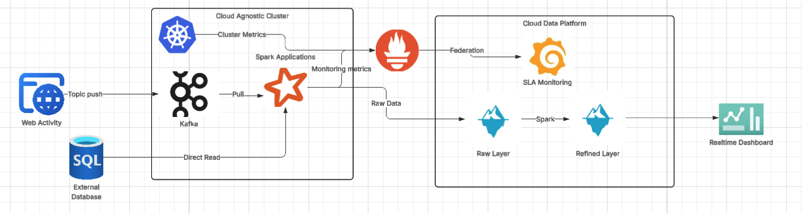
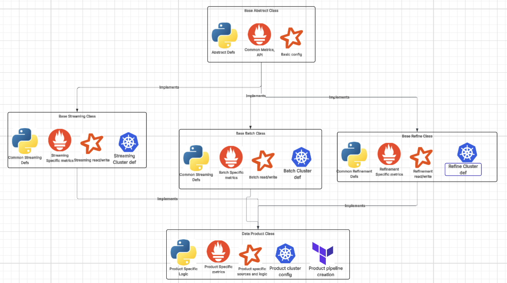

# Design
## Basic Principles

The modernized data pipeline design needs to provide the following principles

### Reliability & Scalability
Critical data from web traffic can provide high volumes of data at uncertain intervals, which can prove challenging to scale effectively. To provide a reliable data pipeline, the infrastructure must be able to scale to meet demand. To support this, we will use Kubernetes clusters to run our streaming application. Kubernetes provides elasticity in cluster definition, so autoscaling can address issues with large scale network traffic, and prevent the cluster from choking on high volumes of data.

### Latency
Since these data sources support real-time dashboards,  also providing low latency data writes. To accomplish this, we will use Kafka, Kubernetes, PySpark, and Iceberg to consume the data.The web applications can push or be scraped by a Kafka cluster, which can be replicated so in the event of a cluster failure data is not lost. This will allow for reliable, near-real-time streaming from the applications into a Kubernetes-backed Kafka instance, which can be quickly consumed by PySpark Structured Streaming.

Additionally, the data will be written into Iceberg tables. Iceberg supports merge-on-read in Avro files, a row-friendly format which will not bog down writes with complex schema resolution or de-duplication, this allowing the data to flow quickly into the cloud data platform.

### Transparency (SLAs)

Having clearly defined SLAs and then presenting those SLAs to users is key to trust in the application. To support this, realtime metrics will be consumed from both the PySpark applications as well as the Kubernetes cluster (and any other infrastructure) by Prometheus. This will provide insight into the performance and reliability of the data by taking key metrics at runtime. Metrics provided by PySpark can include read/write latency, row counts, five num sums, and any other KPIs germaine to the dataset. Metrics provided by the Kubernetes cluster can include cluster health, bytes consumed, container states, and local storage used. This can all be exposed in Grafana, which will visualize all the above metrics in near-real-time, thus providing metadata insights alongside the realtime dashboards. This also keeps the solution cloud-agnostic.

### Simplicity
Data pipelines often become large and monolithic as feature requests and break fixes roll in, and therefore become difficult to manage. To improve developer experience and guarantee quality across pipelines, the pipelines will be harmonized with abstract Python classes which will contain basic funcitonality to connect with data sources, provide key components such as Spark and Prometheus, and provide consistent building blocks for all key components while still allowing developers to write logic to define data transformations as they see fit.

## Pipeline Design

## Code Design

